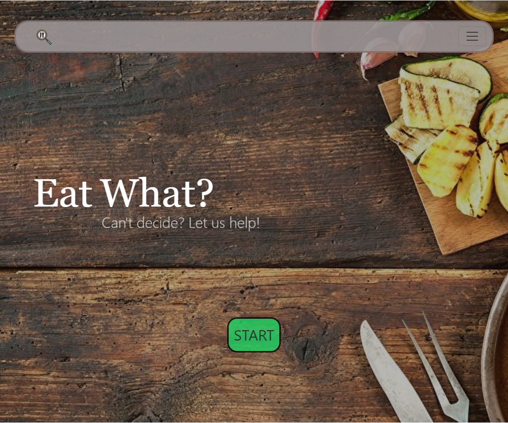
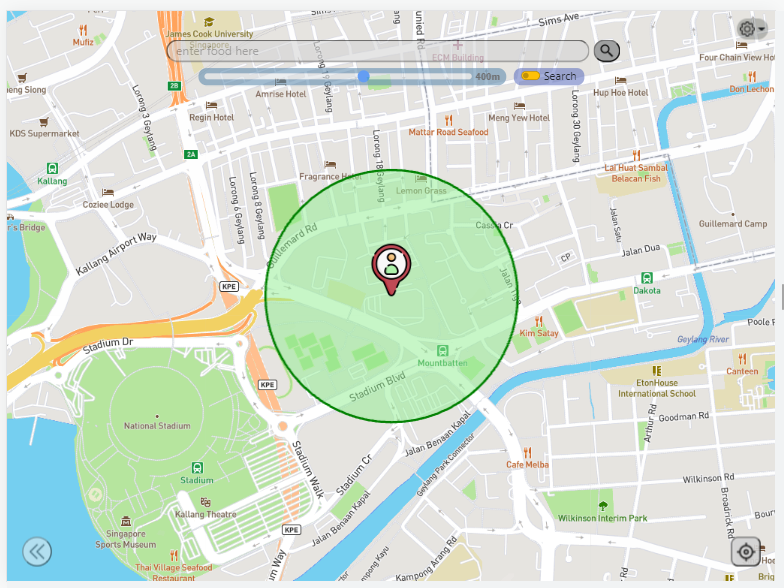
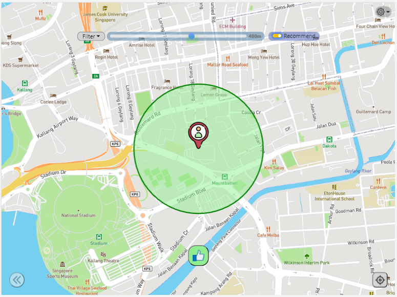

# Project: Eat What?

## Introduction
Do you have cravings for a particular food from time to time? Do you spend too much time deciding on what to eat that your 1 hour lunch/dinner break became a 30 minutes snack time instead? Or do you need recommendations on what is good around you?

**Eat What?** provides convenience of food finding within walkable distance. You can search for a particular food as well as get recommendations of what's good near you too!

Let us help you make your meal times more convenient and enjoyable!

## First Look
**Eat What?** can be divided into the start-page (landing page) and map page. The map page has two modes - search and recommend.

Start Page

Map Page (Search Mode)

Map Page (Recommend Mode)

## Quickstart
- Application link:
    - https://sh3ngsh3ng.github.io/Project-1/
- User Guide of application:
    - https://docs.google.com/presentation/d/1Cm3rBH1L73uFeR4W0letMNpHElTwNgAZpGLnGPSro_w/edit?usp=sharing

# Planning of Project
The planning of project is divided into 6 phases:
- Phase 1: Research
- Phase 2: UI/UX Planning
- Phase 3: Functionality
- Phase 4: Structuring & Styling
- Phase 5: Responsiveness
- Phase 6: Debug

For more information, refer to the projectplanning.md file

# Technologies Used
- HTML & CSS
- Javascript
- Bootstrap (v 5.1)
    - Navbar
    - Dropdown menus
    - Slider Bar
    - Switch
- LeafletJS (map)
- APIs
    - fourSquare search (GET)
    - fourSquare recommend (GET)
    - oneMap routing (GET & POST)
- JQuery 
    - elements manipulation (animations, adding & removal of DOM)
    - for API calling (oneMap)
- axios
    - for API calling (fourSquare)
- Google Polyline Decoder to decode routing from oneMAP api

# The 5 Planes of UI/UX
## Plane 1: Strategy
### Target Audience:
- Consumers
  - The general public (non-foodie)
  - Foodie (a person with a particular interest in food)
- Age + IT Literacy: Younger audience who are more tech savvy
- Pain Points:
  - Not sure what to eat, indecisive.
  - May be unfamiliar with the place. E.g. User's first time in the area.
  - Might have "cravings" for a certain type of food.
- Needs:
  - Information on food around user's location
    - Dining types: Restaurants, cafes, bars, etc
    - Certain Type of Food: Chicken rice, Laksa, etc
  - Recommendations of good food around user's location

### Organisation Goals:
- To share the love of food with all our users. Connecting their taste buds/palates with the wonderful food that they crave or have yet to discover.
- To develop a tool that will provide resolve all, if not majority, of the pain points of the target audience.

### The User Stories:
- As a user, I want to **search for a particular food that is within walkable distance (500m)** so that I can save time and fulfil the craving!
- As a user, I want to **be recommended nice food near me that I can try** so that I can enjoy the good food!
- As a user, I want to **find out what are the interesting recommended places such as bars/restaurants/cafe/coffeeshop/dessert place to visit** so that I visit them and try them out!
- As a user, I want to **find out how to find my way towards my search and recommended results destination** so that I have no problem finding my way there!
- As a user, I want to know **the estimated time it takes me for me to reach the search and recommended results destination** so that I can make a more informed decision on whether to choose that location.

## Plane 2: Scope (Functions & Features)
### Functional:
- Search for a particular food near me
- Recommendations of food near me
- Adjusting distance (walkable) for search
- Filter function
    - restaurants, bars, cafes, coffeeshop, dessert
- Routing
    - show route
    - show estimated time
- Option to remove radius marker
- Option to select location
- Reposition Button
- Refer to the following link for User Guide:
    - https://docs.google.com/presentation/d/1Cm3rBH1L73uFeR4W0letMNpHElTwNgAZpGLnGPSro_w/edit?usp=sharing

### Non-functional:
- Mobile responsive

## Plane 3 & 4: Structure & Skeleton
- All features are all within 3 clicks
- Webpage is designed as a Single Page Application
- Both structure and skeleton are documented in the slides below:
    - https://docs.google.com/presentation/d/1Q_DtTH2Zh-jjWc5D-Z_3CdDgQJ6-Hh-VSp72L-VMTmg/edit?usp=sharing

## Plane 5: Surface
### Colours:
- A somewhat darkish theme was used to give off a "classy" feels to the application.
    - Examples:
        - Greyish colours was chosen for many of the elements such as Navbar, navbar dropdown, etc
        - Grayscale filter was also used on the background image
- Clickable buttons such as the "START" button and buttons that yield results (search/recommend) are given a greenish colour to make it more pleasant and clickable

### Images:
- As a picture speaks a thousand words, a food related background image was used to fit the theme of the application.

### Fonts:
- Font Colour: White is used in the start-page (landing page) as to give a contrast to the darkish classy feels
- Font Sizes are adjusted based on screen sizes
- Typography: As the web application does not use much of words, the main fonts that were styled was the "Eat What?" found in the front page. Serif was used as it is typically used in header and has the tradition/respectable/reliable feel. Which is beneficial for us to associate our brand name with. Furthermore, Georgia was chosen as it confers the formal and assertive mood that ties in with the classy feels the front page is going for.

### Icons:
- Icons used are related to the function/features. All results yielding from the filter function have icons that matches the category. I.e. Cafe icon for cafe results, restaurant icons for restaurant results
- For the results from functions, coloured icons are used to make the application more pleasing. Icons chosen are to somewhat have a same theme/feels. 
- Other functions such as back button, settings, etc uses icons that are commonly known. E.g. gear icon for settings, back arrow for back button, thumbs up icon for recommendations.

# Mobile Responsiveness
The strategy for mobile responsiveness is to size elements with ratio units (e.g. %, vh/vw, etc). Mobile responsive elements from bootstrap was also used where applicable.

Due to the constraints of time and choice of strategy, mobile responsiveness does not cater for all range of device.

Below are the devices that can be supported:
- Mobile M (375) to Mobile L (425)
- iPhone 6/7/8
- iPhone 6/7/8 Plus
- iPhone X
- Tablet (768)
- iPad 
- Surface Duo
- Laptop (1024 x 760)
- Laptop (1440 x 1036)

Below is the link to the screen sizes view:
- https://docs.google.com/presentation/d/19_yJY0TIJ8dx-SuCxX0KJDnHkZBysldYS733h6TCWeU/edit?usp=sharing

**Note for other sizes:**
- For the sizes smaller than 375px, elements can be adjusted to avoid overlapping.

# Test Cases
Testing is done using test cases. The two main testing area is on the two main functions - **Searching for food** & **Recommending Food/Places** in order to meet the acceptance criteria of the user stories.

Test cases can be found in the following link: https://docs.google.com/document/d/15mLwuPeZV9SA_2QC3s1Arrp7cIlNIdYXdebQtecfQR4/edit?usp=sharing

# Bugs
As some functions/features interacts with one another, testing is done after the implementation of every function/feature. 

For example, during the addition of Settings Menu, the two functions added (Radius Marker & Choose Location) interacted with many other features. I.e. previous markers from search results placed were not cleared when settings were toggled, the toggles doesn't work with location button, etc. The obvious bugs were patched before other functions are added to the application.

For the bugs encountered during the whole project, refer to projectplanning.md.

Below are some of the unresolved bugs:
- Search results of food from fourSquare API displays further than the input distance. This results in some search results lying outside of the radius marker
- Not all Lat Lng coordinates from fourSquare API can be routed via the routing API. Some coordinates are not in the correct format (WGS84) for the routing API to return the route geometry

# Challenges Faced
### Challenge 1:
As more functions/features are added, the possible variations/scenarios increases. Particularly challenging functions/features are:
- Geolocation
    - Have to make sure all the functions accounts for both type of users (allow/disallow geolocation)
- Slider Bar
    - Affects all results accordingly (e.g. radius marker, food search results, recommendation results)
- Settings Menu
    - Radius Marker
        - Switching on and off
    - Choosing Location (Ping Dropping)
        - Keeping track of current location
        - Linking ping's location with API
- Routing API
    - Understanding how the 

### Challenge 2:
Making the application mobile responsive was one of the most challenging. The initial strategy (design with laptop sizing first using mobile responsive units, elements, etc) adopted was not the best. The lack of foresight, knowledge and experience lead to this mistake. 

**A mobile first strategy should have been adopted.**

Nevertheless, mobile responsiveness was achieved, albeit more tediously. A very expensive and valuable lesson!

# Incomplete + Possible Improvements:
- (incomplete) Ensure better mobile responsiveness for the smallest screen size.
- (incomplete) Link pages in the navbar are deactivated as the pages are not ready.
- (incomplete) Tutorial Page 
- (incomplete) Contact Us page
- Addition of Cafe Hopping function
    - Another function that was conceptualize was the function to allow user to plan their cafe hopping journey using the app

# Credits & Acknowledgements
I would like to acknowledge the lead instructor Mr Paul, teaching assistant Sam and all my classmates for providing guidance and emotional support during the duration of this project.

All icon images are sourced from flaticon.com. Authors of the icons are as listed: Freepik, Eucalyp, iconixar, bqlqn.

Background image is sourced from: https://wallpaperaccess.com/french-food

Special thanks to Jan Pieter Waagmeester for the plugin to decode the google polyline. Words cannot express the elation when I got the routing function to work.

Last but not least, I would like to thank Google and StackOverflow for their unwavering 24/7 support. 

# Disclaimer
The project is for educational purposes only. Other than the idea/concept of the project, all media files and technologies used in this project belongs to their respective owners and I do not claim any right over them. 

